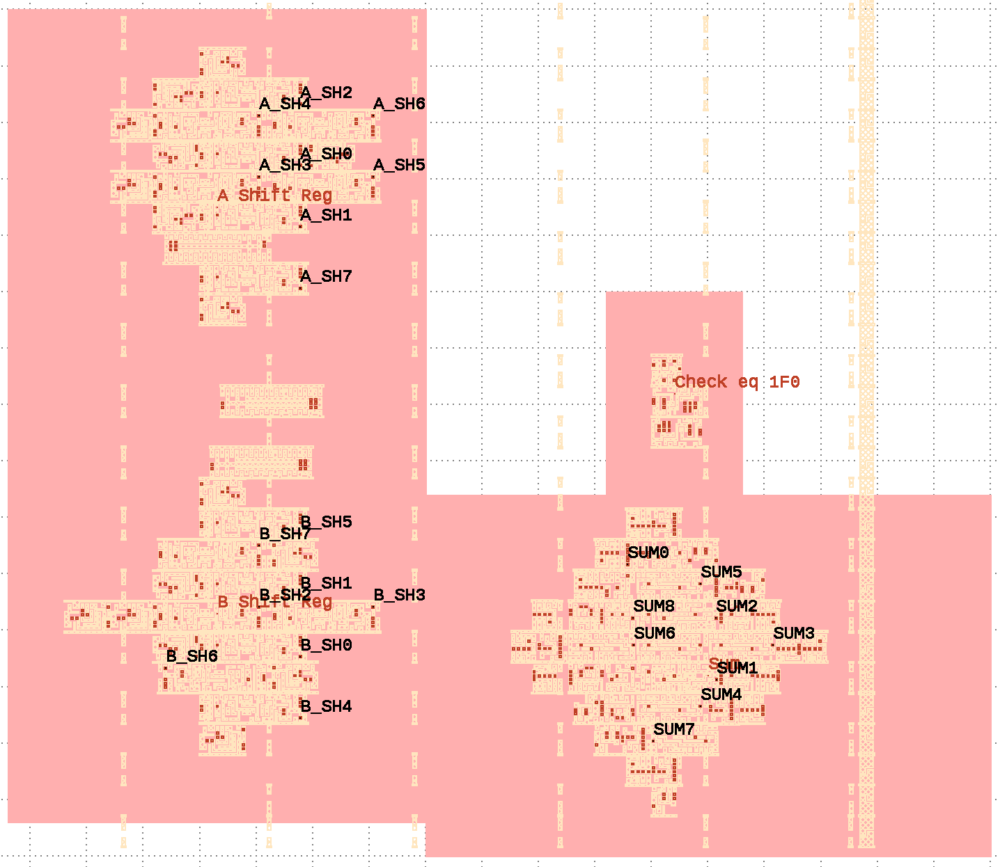
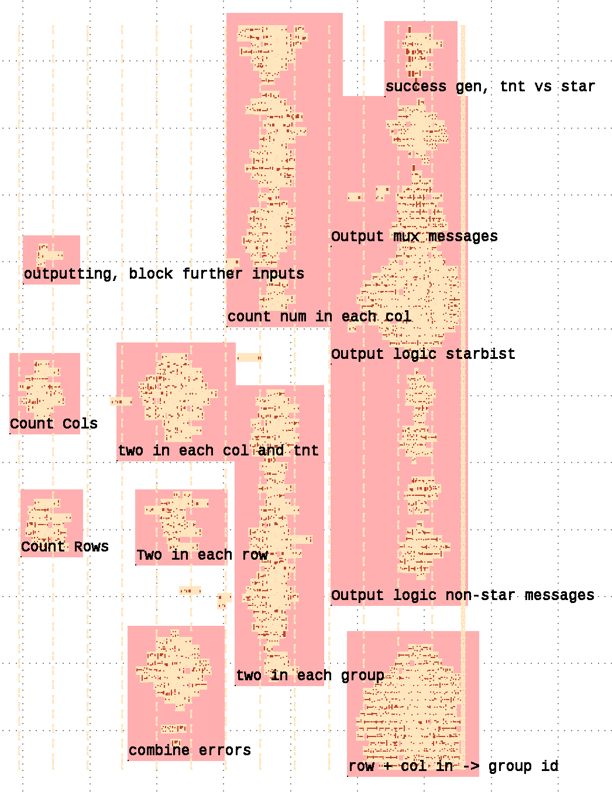
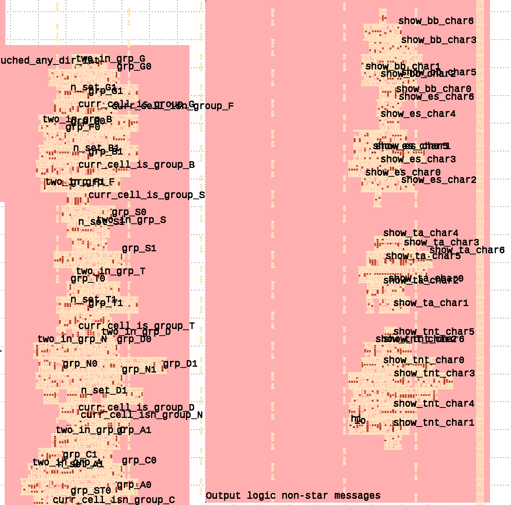

### Running
#### External dependencies

Sby for formal proof: https://github.com/YosysHQ/oss-cad-suite-build

gtkwave for viewing vcds: https://gtkwave.sourceforge.net

icarus verilog for running simulations: https://github.com/steveicarus/iverilog


#### Setup:
```
uv venv
uv sync
source .venv/bin/activate
```

### Warmup:
> Note: First run will take some time as gdsfactory initialises its caches!

> Note: Not all formal proofs are expected to pass! You can use counterexamples to find the interesting cases, e.g. assert(!solution) will fail, giving you a waveform with solution set

```
python gds_to_rtl.py -i warmup/config.yaml
sby-gui warmup
```
For command line version
```
cd warmup
sby -j 8 -f formal.sby
gtkwave formal_bounded_find_soln/engine_0/trace.vcd tb/gtkwave.gtkw
```

Simulation
```
cd warmup
./run_iverilog
gtkwave generated/sim.vcd tb/gtkwave.gtkw
```

NB you can view where the outputs of each submodule are driven in klayout 
```
generated/sky130_text_layout.gds
```

Design partitions and output pins




### Writeup (spoilers!)


#### Puzzle:
```
python gds_to_rtl.py -i puzzle/config.yaml
sby-gui puzzle
```
**see formal.sby/tb for explaination of the proofs**

For command line version:
```
cd puzzle
sby -j 8 -f formal.sby
gtkwave formal_find_soln/engine_0/trace.vcd tb/gtkwave.gtkw
gtkwave formal_find_bb/engine_0/trace.vcd tb/gtkwave.gtkw
gtkwave formal_find_es/engine_0/trace.vcd tb/gtkwave.gtkw
gtkwave formal_find_tnt/engine_0/trace.vcd tb/gtkwave.gtkw
gtkwave formal_find_star/engine_0/trace.vcd tb/gtkwave.gtkw
gtkwave formal_find_ta/engine_0/trace.vcd tb/gtkwave.gtkw

// Find any unreachable flops
rg -No -P "[^\s.]+_never_changed" formal_check_unr/FAIL | sort |uniq > all_toggles.log   
rg -No -P "[^\s.]+_never_changed" generated/puzzle.v | sort |uniq > all_asserts.log  
diff all_toggles.log all_asserts.log
> p_inky_cnt_7_never_changed

// Find any flops that change when !enable
rg -No -P "[^\s.]+_never_changed" formal_check_enable_doesnt_matter/FAIL | sort |uniq
> p_TNT_not_STAR_never_changed
> p_output_bisty_flop0_never_changed
> p_output_bisty_flop1_never_changed
> p_output_bisty_flop2_never_changed
> p_output_bisty_flop3_never_changed
> p_output_bisty_flop4_never_changed
> p_output_bisty_flop5_never_changed
> p_output_bisty_flop6_never_changed
> p_output_bisty_flop7_never_changed
> p_outputting_cnt_0_never_changed
> p_outputting_cnt_1_never_changed
> p_outputting_cnt_2_never_changed
> p_outputting_cnt_3_never_changed
> p_outputting_latched_never_changed
> p_success_never_changed

```

Simulation
```
cd puzzle
./run_iverilog
gtkwave generated/sim.vcd tb/gtkwave.gtkw
```
Design partitions



Output names are available, but overlap at high zooms




All in python - first extract the nets:
- Use gdsfactory with sky130 PDK to extract the metals & vias
- Use shapely to union the polygons(+boxes +paths), putting the result in an rtree (STRtree)
- Find intersections between the via and the layer above and below - these nets are connected
- Enumerate the nets into unique names (searching through for any connected nets via vias)

Parse the gate functions from "sky130_fd_sc_hd__tt_025C_1v80.lib"  and find which nets the pins connect to (same as for the vias)
substitute the net into the equations, and generate the Verilog

Try and reverse engineer the Verilog for a while, fail, and throw formal at it
using SymbiYosys (sby) find the flag, then iterate through all different text outputs 

```
"TRY AGAIN" - any that doesn't match the below:
"BIG BANG" = "1" * 121
"EMPTY SKY" = "0" * 121
"(* TWO STARS *)" = "0000000101010000100000000000010101010000000000001010000001000001000000100000101000010000000100000010000010010001010000000"
"TWO NOT TOUCH" =  
"0000100010000000010100100000010000000110000010000010000010000010000010010000000100000010000100000010000000001101010000000"
"0000001010000000011000000010000101100000000010001000000001000001000000000001100100100000000100010000000010000101010000000"
"1000000010000000001100001000010000001100000001000100000100000000100000010001000000010001000100100000000100000101100000000"
...
```
There are over 100 of TWO NOT TOUCH - switch back to analysis of the verilog + waveforms when passing through 1 bit

Find the different groups in the verilog by hand - 

```
A A A A A B B E D D F
A A J A A B E E D D F
A A J B B B B E E D F
A A J B S S S F E E F
J A J B S F F F F F F
J J J B S S S F C C C
B B B B B B S F C G G
B K K K S S S F C G G
B K K H F F F F C G G
B B K H H F F F C C C
B K K H F F F F F F F
```

it spells out JSC from top left to bottom right - 
```
_ _ _ _ _ _ _ _ _ _ _
_ _ J _ _ _ _ _ _ _ _
_ _ J _ _ _ _ _ _ _ _
_ _ J _ S S S _ _ _ _
J _ J _ S _ _ _ _ _ _
J J J _ S S S _ C C C
_ _ _ _ _ _ S _ C _ _
_ _ _ _ S S S _ C _ _
_ _ _ _ _ _ _ _ C _ _
_ _ _ _ _ _ _ _ C C C
_ _ _ _ _ _ _ _ _ _ _
```

Double check answer by putting it back through formal, proving these two cases:
```
if (all_cols_sum_to_two && all_rows_sum_to_two && all_masks_sum_to_two) begin
    if (two_touch) begin
        // up down left right or diagonals touch - print TWO NO TOUCH
        assert property (was_tnt);
    end else begin
        assert property (was_twostars);
    end
end
```

SBY  0:17:15 [formal_basic] engine_0: Status returned by engine: pass


#### after submitting, expand proof to all the cases

```
    if (last_char) begin
        assert (was_twostars || was_try_again || empty_sky || was_tnt || was_bb);

        assert (was_try_again == (!matches_bb_soln && !matches_es_soln && !row_col_masks_match));
        assert (was_bb == matches_bb_soln);
        assert (empty_sky == matches_es_soln);
        assert (was_twostars == matches_twostar_soln);
        assert (was_tnt      ==  (two_touch && row_col_masks_match));
        assert (was_twostars == (!two_touch && row_col_masks_match));
    end
```
